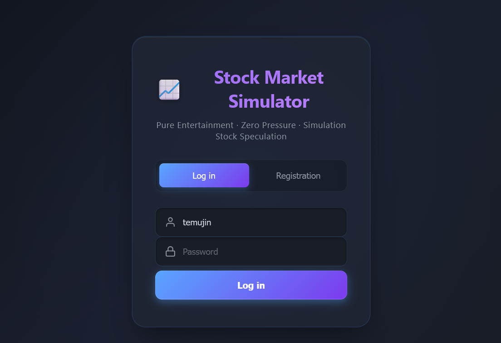

<p align="right">
  <a href="README.md">
    
  </a>
</p>

# Stock Simulator

A pure-entertainment, zero-stress Chinese A-share stock trading simulator platform. All data is generated and stored locally inside your browser without connecting to real market APIs. Users can learn trading rules, experience market fluctuations, and test strategies in a risk-free environment.

> Version: v2.4.0
> Developer: Moke Xintu (Bilibili)

---
<div align="center">
  <a href="https://www.bilibili.com/video/BV1sWNwzVEek/" target="_blank">
    
  </a>
  <p>📺 <b><a href="https://www.bilibili.com/video/BV1sWNwzVEek/" target="_blank">Click here to watch the full demonstration video on Bilibili.</a></b></p>
  <p>▶️ <b><a href="https://youtu.be/SESTTuLqTi4?si=GlUPLyUWA1FDomzB" target="_blank">Click here to watch the full demonstration video on YouTube.</a></b></p>
</div>

---

## Table of Contents

-   [Project Overview](#project-overview)
-   [Features](#features)
-   [Tech Stack](#tech-stack)
-   [Project Structure](#project-structure)
-   [Quick Start](#quick-start)
-   [Core Features Detailed](#core-features-detailed)
    -   [User System](#user-system)
    -   [Save System](#save-system)
    -   [Market Simulation System](#market-simulation-system)
    -   [Trading System](#trading-system)
    -   [Automated Trading System](#automated-trading-system)
    -   [Achievement System](#achievement-system)
    -   [Time Control System](#time-control-system)
    -   [K-Line Charting System](#k-line-charting-system)
    -   [Debug Panel](#debug-panel)
    -   [Themes & UI](#themes--ui)
    -   [Internationalization (i18n)](#internationalization-i18n)
    -   [Beginner Tutorial](#beginner-tutorial)
    -   [Data Security & Backup](#data-security--backup)
-   [Trading Rules](#trading-rules)
-   [UI Navigation Guide](#ui-navigation-guide)
-   [Frequently Asked Questions](#frequently-asked-questions)
-   [Developer Information](#developer-information)
-   [Contributing](#contributing)
-   [License](#license)
-   [Future Roadmap](#future-roadmap)
-   [Star History](#star-history)

---

## Project Overview

Stock Simulator is a zero-dependency web application built purely with frontend web technologies (HTML5 + CSS3 + JavaScript). No backend server or database is required—simply open `index.html` to run. The project simulates core mechanisms of the Chinese A-share market, including daily price limits, circuit breakers, T+1 settlement, transaction fees, and stamp duties. It features a built-in pool of over 300 stocks across 80+ industries to provide a realistic trading experience.

Positioned as a "pure entertainment" tool, it involves no real capital. All market data is generated locally by algorithms in real-time, designed to help users:

-   Learn the basic process and rules of stock trading
-   Understand mechanisms like daily price limits, T+1, and commission fees
-   Test trading strategies (especially via the automated trading feature)
-   Experience the psychological dynamics of market fluctuations with zero stress

---

## Features

### Core Features

-   **Full User System**: Supports registration, login, password changes, account deletion, and auto-login
-   **Multi-Save Management**: Each user can manage multiple independent saves (create, load, rename, delete, switch)
-   **300+ A-Share Stock Pool**: Covers 80+ sectors including Banking, Brokerages, Spirits, Pharma, Semiconductors, Clean Energy, Defense, etc.
-   **Realistic Market Simulation**: Random price fluctuations, volume linkages, 5-level Order Book, and K-line chart data
-   **Complete Trading Cycle**: Buy, sell, position management, order history, and real-time floating P&L calculation
-   **T+0 / T+1 Dual Modes**: Choose whether to enable intraday turnaround trading at game startup
-   **Configurable Fees**: Customizable buy/sell commissions (including stamp duty)

### Advanced Features

-   **Automated Trading System**: Multi-stock, multi-condition automated strategies, including price thresholds, percentage changes, target profits, interval triggers, and stop-loss / take-profit risk controls
-   **Achievement System**: 50+ achievements across Bronze, Silver, Gold, and Legendary tiers, plus easter eggs
-   **K-Line Charts**: Custom Canvas-rendered candlestick charts with wheel zoom, drag pan, box zoom, touch support, and volume histograms
-   **Time Control System**: Simulates trading hours with support for manual adjustments, presets, and random jumps
-   **Debug Panel**: Hidden developer dashboard to modify capital, unlock achievements, control time, and reset market state
-   **Multi-Theme Support**: Dark (default), Light, and Festival themes
-   **Bilingual UI (Chinese/English)**: Built-in internationalization (i18n) system with one-click language switching; preferences are automatically saved
-   **Beginner Tutorial**: Guided 9-step walkthrough automatically triggered for new users
-   **Save File Import/Export**: Export encrypted user data files for cross-device migration
-   **Responsive Design**: Compatible with desktop and mobile screens

---

## Tech Stack

| Category       | Technology                                                 |
| :------------- | :--------------------------------------------------------- |
| Markup         | HTML5                                                      |
| Styling        | CSS3 (CSS Variables, Flexbox, Grid, Responsive Layout)     |
| Core Logic     | Vanilla JavaScript (ES6+, Classes, Maps, Sets, Promises)   |
| Charts         | Canvas 2D API (Custom implementation for Candlestick/Volume)|
| Data Storage   | LocalStorage                                               |
| Encryption     | Custom XOR + Base64 encryption & custom hashing            |
| Dependencies   | None (Zero Third-Party Libraries)                          |

---

## Project Structure

```text
Stock simulator/
├── index.html              # Main HTML structure
├── game.js                 # Core game logic (5200+ lines)
│   ├── LimitManager class        # Daily price limits & circuit breaker manager
│   └── StockSimulator class      # Main game controller & business logic
├── stockData.js            # A-share stock pool data (300+ stocks)
├── achievements.js         # Achievement configuration & logic
├── crypto.js               # Encryption utilities (XOR + Base64 + Hash + UUID)
├── i18n.js                 # Internationalization core module (I18nManager class)
├── locales/                # Language resource files directory
│   ├── zh-CN.js            # Chinese language resources (512 translations)
│   └── en-US.js            # English language resources (512 translations)
├── styles.css              # Full application styles & themes (incl. language switch UI)
├── images/                 # Project image assets
│   ├── cover.jpg           # Chinese version cover image
│   └── cover-en.png        # English version cover image
└── LICENSE                 # MIT open-source license
```

### Script Loading Order

In `index.html`, scripts must be loaded in the following exact order due to global dependencies:

```html
<script src="stockData.js"></script>     <!-- Global object StockPool -->
<script src="crypto.js"></script>        <!-- Global object Crypto -->
<script src="achievements.js"></script>  <!-- Global object AchievementSystem -->
<script src="locales/zh-CN.js"></script> <!-- Global object ZH_CN (Chinese resources) -->
<script src="locales/en-US.js"></script> <!-- Global object EN_US (English resources) -->
<script src="i18n.js"></script>          <!-- Global object I18n (i18n instance) -->
<script src="game.js"></script>          <!-- Main application, depends on all above -->
```

## Quick Start

### System Requirements

-   Any modern web browser (Chrome, Firefox, Edge, Safari, etc.)
-   Support for LocalStorage and Canvas API
-   No runtime environment or package installation required

### Installation & Execution

1.  Download or clone this repository to your local device.
2.  Double-click `index.html` or open it in your web browser.
3.  On the login screen, click **Register**, fill in a username (2-20 characters) and password (6-20 characters).
4.  Log in using your registered credentials.
5.  In the Save Select screen, click `+ New Game`.
6.  Set your initial cash, trading fees, and rules, then click **Start Game**.
7.  Start trading from the main dashboard.

> **Tip:** The beginner tutorial will trigger automatically on your first run. You can skip it at any time.

## Core Features Detailed

### User System

User information is stored in browser LocalStorage under the key `stock_simulator_users`, encrypted via XOR + Base64.

#### User Data Schema

```javascript
{
  username: String,              // Username
  passwordHash: String,          // Hashed password generated by Crypto.hash
  createdAt: Number,             // Registration timestamp
  saves: Array,                  // Array of save slots
  achievements: Array,           // Global user achievements (across saves)
  tutorialCompleted: Boolean,    // Tutorial status
  theme: 'dark' | 'light' | 'festival',  // Theme preference
  refreshRate: Number,           // Market update rate in ms
  lang: 'zh-CN' | 'en-US'        // Language preference (i18n)
}
```

#### Feature List

-   **Register**: Validates 2-20 char username and 6-20 char password with confirmation; enforces unique usernames.
-   **Login**: Hash-matched password verification; supports quick enter-key submit.
-   **Auto-Login**: Remembers the last active user session.
-   **Change Password**: Requires verification of the current password and confirmation of the new password.
-   **Delete Account**: Requires typing `DELETE` for irreversible account removal.
-   **Data Migration**: Automatically fills missing data properties (`tutorialCompleted`, `theme`, `refreshRate`, `lang`) for legacy data formats upon load.

### Save System

Each user can maintain isolated save slots.

#### Save Data Schema

```javascript
{
  id: String,                    // UUID
  createdAt: Number,             // Creation timestamp
  fund: Number,                  // Available cash (in cents/cents-equivalent integer)
  initialFund: Number,           // Initial starting cash
  holdings: Object,              // Map of holdings keyed by stock code
  records: Array,                // Up to 100 historical transaction records
  watchlist: Array,              // Array of stock codes added to watchlist
  achievements: Array,           // Achievements tied to this save
  settings: {                    // Custom game rules
    buyFee: Number,              // Buy fee percentage
    sellFee: Number,             // Sell fee percentage (incl. stamp duty)
    t0Mode: Boolean,             // T+0 mode flag
    tradeUnit: 1 | 100           // Minimum trade unit (1 share or 1 lot)
  },
  dayTrades: Object,             // Intraday trade log for T+1 tracking
  gameStats: Object,             // Game statistics for achievement evaluation
  autoTrade: Object              // Auto-trading settings & log
}
```

#### Holdings Schema

```javascript
{
  '600519': {
    name: 'Kweichow Moutai',
    quantity: Number,            // Quantity held
    avgPrice: Number,            // Average purchase price
    totalCost: Number            // Total cost basis
  }
}
```

Save Slot Actions: Create, Load, Rename (1-20 chars), Delete, Switch. Supports exporting/importing encrypted `.txt` files across devices.

### Market Simulation System

Market updates are driven periodically by `updateMarket()` in `game.js` based on the configured refresh rate (default 3s).

#### Stock Object Schema

```javascript
{
  code: '600519',
  name: '贵州茅台',
  industry: '白酒',
  price: Number,                 // Current price
  prevClose: Number,             // Previous close price
  open: Number,                  // Opening price
  high: Number,                  // High price of the day
  low: Number,                   // Low price of the day
  volume: Number,                // Current total daily volume
  dailyVolume: Number,           // Current daily volume
  prevDailyVolume: Number,       // Previous daily volume
  avgVolume: Number,             // 5-day average volume
  history: Array,                // Up to 60 historical K-line objects
  bid: Array,                    // 5-level Bid order book
  ask: Array                     // 5-level Ask order book
}
```

#### Price Fluctuation Algorithm

-   **Standard Stocks**: Each tick generates a random fluctuation of (-2% to +2%), calculated as `(Math.random() - 0.5) * 0.04`.
-   **Easter-Egg Stock "影视飓风" (Code 999999)**: 70% chance to rise (+0.5% to +3%), 30% chance to drop (-0.5% to -2%), outperforming average stocks.
-   Price boundaries are clamped to daily limit prices via `LimitManager.clampPrice()` and rounded to two decimal places (0.01 CNY).

#### Volume Algorithm

Daily Volume = Previous Volume × (1 + Return Rate × 1.5) bounded within [-20%, +20%], plus a ±3% random variance.

Trading Day Rollover: A new trading day triggers every 20 ticks. This updates previous close prices, resets circuit breaker states, recalculates 5-day volume, clears intraday data, and pushes a new K-Line bar.

Order Book (Depth): Generates 5 levels of bids and asks per tick based on current price increments of 0.01 CNY with random quantity distributions.

### Trading System

Includes complete order submission, parameter validation, financial execution, transaction logging, and real-time P&L updates.

#### Execution Flow

1.  User inputs stock code, order price, and order quantity on the Trade page.
2.  `validateTradeParameters()` verifies constraints.
3.  `executeTrade()` handles fund deduct/credit and portfolio updates.
4.  `recordTrade()` logs the order details.
5.  `updateAfterTrade()` refreshes UI views.

#### Validation Rules

-   Must be executed during market trading hours (9:30-11:30, 13:00-15:00).
-   Price must be greater than 0.
-   Buy price cannot exceed upper price limit (+10%); Sell price cannot fall below lower limit (-10%).
-   Stock must not be halted due to circuit breakers.
-   Double confirmation modal is triggered if the order price deviates over 10% from the current market price.
-   Stock code must exist in the stock pool.

#### T+1 Rule (Default)

-   Stocks bought today cannot be sold today.
-   Stocks sold today cannot be bought back today (when `t0Mode = false`).
-   Tracks daily stock transaction frequencies using `dayTrades`.

#### Fee Calculation

-   Buy Fee = Order Amount × Buy Fee Rate (Default 0.03%)
-   Sell Fee = Order Amount × Sell Fee Rate (Default 0.13%, includes stamp duty)

Trade Unit: Configure minimum trade increments to 1 share or 100 shares (1 lot). Quantities automatically round to the configured unit.

### Automated Trading System

Allows users to build automated trading logic for multiple stocks.

#### Parameters

| Parameter        | Description                                                          |
| :--------------- | :------------------------------------------------------------------- |
| Stock Code       | Code present in the stock pool                                       |
| Direction        | Buy / Sell                                                           |
| Trigger Type     | Price Threshold / % Change / Profit Target / Time Interval           |
| Trigger Condition| Greater than / Less than / Equal to value                            |
| Order Quantity   | Quick presets: 1/4, 1/2, or All-In                                   |
| Execution Price  | Market Price or Limit Price                                          |
| Stop Loss Amount | Automatically sells when losses reach threshold                      |
| Take Profit Amount| Automatically sells when profits reach threshold                    |
| Max Executions   | Execution cap for the rule                                           |
| Max Trade Amount | Single order financial spending cap                                  |

#### Triggers

-   **Price Threshold**: Triggers when price meets threshold.
-   **% Change**: Triggers when daily percentage movement reaches threshold.
-   **Profit Target**: (Sell only) Triggers when position P&L reaches specified amount.
-   **Time Interval**: Auto-triggers every 30 seconds.

Cooldown & Controls: Default 5-second cooldown per rule (30s for Interval mode) to prevent rapid multi-triggers. Automatically checks Stop Loss / Take Profit targets.

### Achievement System

Defined in `achievements.js`, containing 50+ unlockable achievements across 4 rarity tiers plus easter eggs.

#### Tiers

| Tier   | Color           | Description                                      |
| :----- | :-------------- | :----------------------------------------------- |
| Bronze | `#cd7f32`       | Introductory achievements for basic actions      |
| Silver | `#c0c0c0`       | Intermediate achievements requiring strategy     |
| Gold   | `#ffd700`       | Advanced achievements for substantial capital growth |
| Legend | Red-Gold Gradient| Top tier achievements for extreme milestones     |

Features: Evaluated after every trade execution using stats compiled via `calculateSaveStats()`. Generates downloadable 600×800 Canvas share cards for unlocked achievements.

### Time Control System

Simulates market operating hours.

-   Morning Session: 9:30 – 11:30
-   Afternoon Session: 13:00 – 15:00
-   Non-Trading Hours: Market data updates pause; order submission is blocked.

Each tick advances time by 2 simulated minutes. Debug settings allow custom manual time inputs or preset quick-jumps (e.g., Morning Open, Night Owl, Market Close).

### K-Line Charting System

Pure Canvas 2D engine built without external charting libraries.

#### Interactions

-   Mouse wheel to zoom along the X-axis
-   Drag and drop to pan horizontally
-   Shift + Drag (or Right-click drag) to box-select and zoom into a section
-   Touch gestures (single finger pan, pinch-to-zoom on mobile devices)
-   Toolbar controls: Zoom In, Zoom Out, Reset view

### Debug Panel

Hidden panel for testing and quick adjustments.

-   **Activation**: Click your username on the Profile (My) page 5 times consecutively.
-   **Features**: Instantly adjust available funds, unlock/lock achievements, adjust game clock, and reset market state.

### Themes & UI

Supported themes via CSS Variables:

-   **Dark (Default)**: `#0d1117` background, GitHub-inspired palette
-   **Light**: Day-mode layout (`#f5f5f5`)
-   **Festival**: Purple & Gold layout (`#1a0a2e`)

Supports market color conventions: Red = Up, Green = Down.

### Internationalization (i18n)

The project includes a complete bilingual (Chinese/English) internationalization system, implemented by the `I18nManager` class in [i18n.js](file:///c:/Users/Administrator/Documents/trae_projects/Stock%20simulator/i18n.js). Language resources are stored in the [locales/](file:///c:/Users/Administrator/Documents/trae_projects/Stock%20simulator/locales/) directory.

#### Core Mechanism

-   **Translation Function**: `I18n.t(key, params)` retrieves translated text by key, supporting `{placeholder}` parameter interpolation
-   **DOM Auto-Refresh**: `I18n.applyToDOM()` batch-updates all elements marked with `data-i18n` / `data-i18n-placeholder` / `data-i18n-title` / `data-i18n-html` attributes
-   **Instant Switching**: Call `I18n.setLanguage(lang)` or `I18n.toggleLanguage()` to switch languages and refresh the entire page instantly
-   **Callback Notification**: `I18n.onChange(callback)` registers language change callbacks for dynamic content re-rendering

#### DOM Attribute Conventions

| Attribute | Purpose |
| :-------- | :------ |
| `data-i18n="key"` | Sets the element's `textContent` |
| `data-i18n-placeholder="key"` | Sets input `placeholder` |
| `data-i18n-title="key"` | Sets the element's `title` |
| `data-i18n-html="key"` | Sets the element's `innerHTML` (for text containing HTML tags) |

#### Language Switch UI

-   **Login page**: Click the 🌐 circular button in the top-right corner to toggle between Chinese and English
-   **Settings panel**: Use the language dropdown to select "中文" or "English"

#### Language Preference Persistence

-   **Logged-in users**: Language preference is saved in the user data's `lang` field and automatically restored on login
-   **Guests**: Language preference is saved in LocalStorage (key: `stock_simulator_lang`)
-   **Fallback**: Missing translation keys automatically fall back to Chinese

#### Localization Adaptations

-   **Currency formatting**: Chinese uses "万/亿" units; English uses "K/M/B" units
-   **Date formatting**: Uses `toLocaleString()` with the current language locale
-   **Achievement system**: Achievement names and descriptions support bilingual switching

### Beginner Tutorial

A 9-step interactive guided overlay explaining market features, order execution, position monitoring, navigation, and shortcuts. Automatically flags `tutorialCompleted = true` when finished or skipped.

### Data Security & Backup

-   **Local Storage**: Data encrypted using custom XOR + Base64 encoding. Passwords stored using 8-character hexadecimal hashes.
-   **Export/Import**: Export game data into an encrypted `.txt` file (`stock_simulator_backup_{username}_{timestamp}.txt`) for backup or cross-device transfer.

## Trading Rules

### Trading Hours

| Session          | Hours         |
| :--------------- | :------------ |
| Morning          | 9:30 - 11:30  |
| Midday Break     | 11:30 - 13:00 |
| Afternoon        | 13:00 - 15:00 |
| Non-Trading Hours| Trading disabled; market simulation paused |

### Daily Price Limits

-   Upper Limit (Limit Up): +10%
-   Lower Limit (Limit Down): -10%
-   Price limits are calculated off the previous day's close rounded to 0.01 CNY.
-   Orders priced above the upper limit or below the lower limit are rejected.

### Circuit Breaker

-   Triggered when single-day percentage change reaches ±20%.
-   Pauses stock trading for 3 simulation tick cycles.
-   Resets on daily market rollover.

### T+1 Settlement

-   Stocks purchased today cannot be sold until the next trading day.
-   Stocks sold today cannot be repurchased on the same day.
-   Can be disabled in game setup by toggling T+0 Mode.

## UI Navigation Guide

The application uses a single-page application (SPA) architecture and switches between screens and pages to present different views.

### Screen Flow

```text
Login / Register Screen -> Save Select Screen -> Game Setup Screen -> Main Game Screen
                                                          ↓
                              Market | Trade | Auto-Trade | Portfolio | Profile
```

### Login / Register Screen (auth-screen)

-   Login form: username, password, supports Enter to submit
-   Registration form: username, password, confirm password, supports Enter to move between input fields
-   Language toggle: 🌐 button in the top-right corner for instant Chinese/English switching
-   Error prompts: real-time login/register errors are displayed

### Save Select Screen (save-select-screen)

-   Save list: displays existing saves with name, creation time, and fund summary
-   Actions: load, rename, delete, create new game, log out

### Game Setup Screen (game-setup-screen)

-   Initial funds: randomly generated (500k-2M) or custom (minimum 100k)
-   Trading fees: buy fee, sell fee (including stamp duty)
-   Trading rules: T+0 toggle, minimum trade unit

### Main Game Screen (main-screen)

The top navigation bar contains five main pages:

#### Market Page (market-page)

-   Left side: search box, watchlist switch, sortable stock list (by name/price/change)
-   Right side: stock details, including name/code, current price, change amount, limit-up/down prices, market time, and status
-   K-line area: includes toolbar (zoom in, zoom out, reset), main chart, and volume sub-chart
-   Five-level order book: five bid and ask levels each
-   Shortcut actions: buy, sell, add to watchlist

#### Trade Page (trade-page)

-   Left side: buy/sell form (code, price, quantity, quick ratio buttons, available funds/estimated amount)
-   Right side: current positions list, including market time and status

#### Auto-Trade Page (auto-trade-page)

-   Three tabs: trigger conditions, risk control, trading records
-   Trigger conditions: stock list + add stock form
-   Risk control: stop loss, take profit, max trade count, max trade amount
-   Trading records: auto-trading history and statistics
-   Top status indicator: not started / running / paused

#### Portfolio Page (portfolio-page)

-   Asset overview: total assets, market value, available cash, floating P&L, total return rate
-   Position table: stock, holdings, cost price, current price, market value, P&L, profit rate
-   Transaction record table: time, stock, direction, price, quantity, amount

#### Profile Page (profile-page)

-   User info: avatar, username, registration time
-   Statistics: session count, transaction count, achievement count
-   Achievement wall: unlocked achievements grouped by rarity, can expand all
-   Action buttons: export/import save, new game, switch save, change password, log out, delete account

### Modal Windows and Panels

-   Settings panel: theme switching, market refresh rate, language selection
-   Password change panel: current password, new password, confirmation
-   Debug panel: fund editing, achievement unlock, time control, market control
-   Achievement popup: new achievement unlock notification
-   Beginner tutorial: 9-step overlay guide
-   Rename save modal

---

## Frequently Asked Questions

### How do I register a new account?
Click the Register tab on the login screen, enter a username (2-20 characters), password (6-20 characters), confirm the password, and then click Register.

### What if I forget my password?
Password recovery is not supported. Please keep your password safe. If you forget it, you must delete the account and re-register, which will permanently delete all stored data.

### Where is my data stored?
All data is stored in the browser's LocalStorage and is not uploaded to any server. Clearing browser data or using private/incognito mode may delete your save data. You should back up your data via Export Save.

### How do I migrate saves across devices?
On the source device, open the Profile page and click Export Save to download a `.txt` file. On the target device, log in to the same account and click Import Save to select the file.

### Why can't I trade outside market hours?
The system simulates real A-share trading hours (9:30-11:30 and 13:00-15:00). Outside those hours, the market stops updating and trading is disabled. You can adjust the time manually in the debug panel if needed.

### How do I open the Debug Panel?
On the Profile page, click your username 5 times quickly in a row to open the debug panel.

### How are achievements unlocked?
Achievements unlock automatically when specific conditions are met, such as your first trade, cumulative profit, continuous winning streaks, holding certain stocks, and similar actions. You can view all conditions in the achievement wall.

### Why didn't my auto-trade trigger?
Possible reasons include:
-   The market was not in a trading session
-   The cooldown period had not expired (default 5s; 30s in interval mode)
-   The trigger condition was not met
-   The stock reached its maximum allowed trade count
-   Available funds or holdings were insufficient

### What is the "影视飓风" stock?
Stock code `999999` is an Easter-egg stock named "影视飓风" (Yingshi Jufeng / MediaStorm). It has a special market algorithm with a 70% chance of rising and behaves better than ordinary stocks.

### How do I switch between Chinese and English?
There are two ways to switch languages:

-   Click the 🌐 button in the top-right corner of the login page for a quick toggle
-   Use the "Language" dropdown in the Settings panel after entering the game

Your language preference is automatically saved and applied on your next visit.

---

## Developer Information

### Core Class Design

The project is centered around two core classes:

**`LimitManager`** (`game.js`): manages price limits and circuit breakers, calculates price boundaries, and tracks breaker states.

**`StockSimulator`** (`game.js`): the main controller running as the singleton `window.game`, containing the complete business logic. The main method groups are as follows:

| Module             | Main Methods                                                                                                                     |
| :----------------- | :------------------------------------------------------------------------------------------------------------------------------- |
| User Management    | `loadUsers`, `saveUsers`, `login`, `register`, `logout`, `deleteAccount`, `checkAutoLogin`                                        |
| Save Management    | `showSaveSelect`, `renderSaveList`, `startGame`, `loadSave`, `deleteSave`, `showRenameSaveModal`                                  |
| Market Simulation  | `initMarketData`, `generateBasePrice`, `generateHistory`, `startMarketSimulation`, `updateMarket`, `generateOrderBook`            |
| Time System        | `updateGameTime`, `updateTimeDisplay`, `isTradingTime`, `randomizeGameTime`                                                       |
| Stock List         | `renderStockList`, `handleSortClick`, `searchStocks`, `toggleWatchlistMode`, `selectStock`                                         |
| Trading System     | `executeTrade`, `validateTradeParameters`, `executeBuyTrade`, `executeSellTrade`, `recordTrade`, `updateAfterTrade`               |
| Position Management| `updatePortfolio`, `updatePortfolioRealTime`, `calculateStockValue`                                                                |
| Achievement System | `updateProfile`, `checkAchievements`, `calculateSaveStats`, `calculateStats`, `showAchievementPopup`                              |
| K-Line Chart       | `drawKLine`, `drawVolume`, `chartZoomIn`, `chartZoomOut`, `chartReset`, `onChartWheel`, `onChartMouseDown`, `onChartTouchStart`   |
| Auto-Trade         | `addAutoTradeStock`, `editAutoTradeStock`, `removeAutoTradeStock`, `startAutoTrade`, `pauseAutoTrade`, `stopAutoTrade`, `checkAutoTradeCondition`, `executeAutoTrade` |
| Debug Panel        | `showDebugPanel`, `debugSetTime`, `debugSetFund`, `debugUnlockAchievement`, `debugResetMarket`                                    |
| Tutorial System    | `startTutorial`, `showTutorialStep`, `nextTutorial`, `endTutorial`                                                                |
| Internationalization| `applyUserLanguage`, `onLanguageChanged`, `toggleLanguage`                                                                       |
| Utility Methods    | `formatMoney`, `showScreen`, `switchTab`, `setTheme`, `exportSave`, `importSave`                                                  |

### Startup Flow

The application startup logic is located in `game.js`:

1.  `DOMContentLoaded` fires
2.  Right-click menu is disabled globally
3.  `StockSimulator` is instantiated, and the constructor calls `init()`
4.  `init()` calls `I18n.init()` (initialize i18n), `I18n.applyToDOM()` (refresh static text), `loadUsers()` (load data and migrate), `bindEvents()` (bind all events), `applyUserLanguage()` (apply user language preference), and `checkAutoLogin()` (attempt auto-login)
5.  Registers `I18n.onChange()` callback to auto-refresh all dynamic content on language switch
6.  Browser back-button behavior is handled via `popstate`

### Data Flow

```text
User action → Event listener → StockSimulator method
                            ↓
                    Modify currentSave / currentUser
                            ↓
                    saveUsers() encrypts and writes LocalStorage
                            ↓
                    Refresh UI rendering
```

### Extension Guide

**Add a new stock**: append an object to the `StockPool` array in `stockData.js` using the format `{ code: '6-digit code', name: 'Name', industry: 'Industry' }`.

**Add a new achievement**: append a new object to the `achievements` array in `achievements.js`, including fields like `id`, `name`, `desc`, `level`, `icon`, and `condition`. Add corresponding stats in `calculateSaveStats()`.

**Modify price limit rules**: adjust the `LimitManager` constructor parameters in `game.js` for `limitUpPercent`, `limitDownPercent`, `circuitBreakerThreshold`, and `circuitBreakerCooldown`.

**Add a new theme**: create a new selector in `styles.css`, such as `body.{theme}-theme`, and update the theme dropdown in `index.html` and the `setTheme()` logic in `game.js`.

**Add a new language or translations**:

1. Create a new language resource file in the [locales/](file:///c:/Users/Administrator/Documents/trae_projects/Stock%20simulator/locales/) directory (e.g., `ja-JP.js`), exporting a global object (e.g., `window.JA_JP`) with the same key structure as `zh-CN.js`
2. Register the new language in the `locales` object in [i18n.js](file:///c:/Users/Administrator/Documents/trae_projects/Stock%20simulator/i18n.js)
3. Add the corresponding `<script>` tag and language dropdown option in [index.html](file:///c:/Users/Administrator/Documents/trae_projects/Stock%20simulator/index.html)
4. Add `data-i18n` attributes to new UI text elements and add corresponding keys to both language resource files
5. Replace hardcoded strings in dynamically generated text with `I18n.t('key')` calls

---

## Future Roadmap

-   [x] Expand stock universe (300+ stocks added)
-   [ ] Implement more complex market simulation
-   [ ] Add multiplayer competition mode
-   [x] Increase achievement variety (50+ items added)
-   [x] Optimize the user interface
-   [x] Add beginner tutorial support
-   [x] Chinese-English bilingual switching (full i18n system implemented)
-   [ ] Support more languages (Japanese, Korean, etc.)

---

## Contact & Credits

If you have questions or suggestions, please contact the developer:

-   Bilibili: Moke Xintu

---

## Contributing

Issues and Pull Requests are welcome! Please follow these guidelines:

### Submitting Issues

-   Before submitting a new issue, please search for existing similar issues
-   Clearly describe the problem, reproduction steps, and browser type/version
-   If there are error messages, please include the full console error output

### Submitting Pull Requests

1.  Fork this repository and create a feature branch: `git checkout -b feature/your-feature`
2.  Follow the existing coding style: vanilla ES6+ JavaScript, modular design, Chinese comments
3.  If adding new UI text, add corresponding translation keys to both `locales/zh-CN.js` and `locales/en-US.js`
4.  If adding features that change the user data structure, add backward-compatible migration logic in `loadUsers()`
5.  Test in mainstream browsers (Chrome, Firefox, Edge) before submitting
6.  In the PR description, explain the changes, testing performed, and whether there are breaking changes

### Coding Standards

-   JavaScript: ES6+ syntax, class-based OOP design, camelCase method names
-   CSS: Use CSS variables for theme colors, BEM-like naming convention
-   HTML: Semantic tags, all translatable text must have `data-i18n` attributes
-   Comments: Add Chinese comments for core logic; functions should document parameters and return values

---

## License

This project is open-sourced under the [MIT License](file:///c:/Users/Administrator/Documents/trae_projects/Stock%20simulator/LICENSE). You are free to use, modify, and distribute it.

Copyright (c) 2026 MOX

---

**Version**: v2.4.0
**Developer**: Moke Xintu (Bilibili)

## Star History

<a href="https://www.star-history.com/?repos=ljy969%2FStock-simulator&type=date&legend=top-left">
 <picture>
   <source media="(prefers-color-scheme: dark)" srcset="https://api.star-history.com/chart?repos=ljy969/Stock-simulator&type=date&theme=dark&legend=top-left&sealed_token=-XxWGc_j93mihOeFBD_uLH8LUOGXrnCG3rfpaH0KGlF3EAsN4gi39zb_Cgv-owfEiStKCJYBQIcgUzDAtLl37CTZnVn1SeYblkwf1AaRcGmopZRz5u-6rg" />
   <source media="(prefers-color-scheme: light)" srcset="https://api.star-history.com/chart?repos=ljy969/Stock-simulator&type=date&legend=top-left&sealed_token=-XxWGc_j93mihOeFBD_uLH8LUOGXrnCG3rfpaH0KGlF3EAsN4gi39zb_Cgv-owfEiStKCJYBQIcgUzDAtLl37CTZnVn1SeYblkwf1AaRcGmopZRz5u-6rg" />
   
 </picture>
</a>
